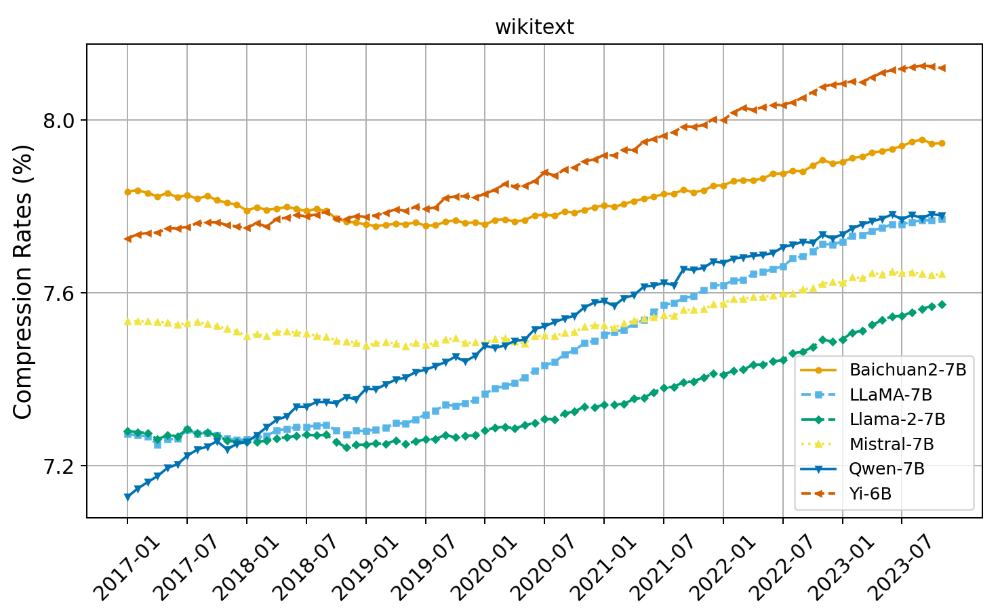
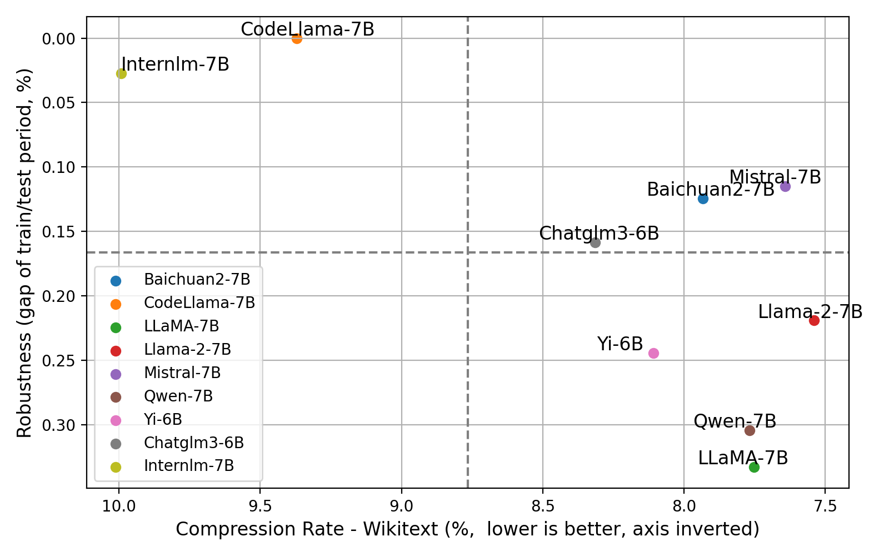

# LLM-Compressive: evaluate LLMs with Data Compression

Compression is believed to be the key feature of intelligence. Llm-compressive allows you to evaluate Large Language Models (LLMs) for generalization and robustness via **data compression**.

Llm-compressive tests LLMs with data compression on timeline, to understand how LLMs generalize over time.



For example, llm-compressive test open source LLMs on wikipedia across 83 months from 2017 to 2023.

**Mistral** and **Baichuan2** show steady performance across all time periods, indicating promissing generalization over time. In contrast, other models demonstrate linearly-worsen curves.

More results on coding, arxiv, news, image, and audio in the paper: [Evaluating Large Language Models for Generalization and Robustness via Data Compression
](https://arxiv.org/pdf/2402.00861.pdf).

# Getting Started

0. Clone and install requirements.

```
git clone https://github.com/liyucheng09/llm-compressive.git
cd llm-compressive
pip install -r requirements.txt
```

1. Run the main test script.

```
python main.py <model_name> <dataset_name> <save_path> <context_size> <batch_size>
```

- `model_name`: the name of the model from HF Hub. See supported [models](#models).
- `dataset_name`: the name of the dataset. choose from `wikitext`, `bbc_news`, `code`, `arxiv`, `audio`, `bbc_image`.
- `save_path`: the path to save the results.
- `context_size`: the context size used for compression. choose from `2048`, `4096`, `8192`, `max_length`, or `stride`.
- `batch_size`: the batch size. This depends on the model scale and your GPU memory.

**Attention!!**, if you need to use huggingface mirror (which means you have problem accessing huggingface.co directly), add `HF_ENDPOINT=https://hf-mirror.com` in your environment variables.

2. Aggregate the results.

```
python results/aggregate_all_results.py <save_path>
```

- `save_path`: the path you saved the results in.

3. Visualize the results.

```
python visualise/timeline_vis.py
```

This will generate a figure visualizing the trend of models' compression rate over time.

```
python visualise/big_table.py
```

This will 1) generate the big table in the paper; 2) generate a figure showing the performance-robustness trade-off of models (like the figure below).



see the explaination of the figure in the [paper](https://arxiv.org/pdf/2402.00861.pdf).

# Models

We have tested the following models:
- codellama/CodeLlama-7b-hf
- baichuan-inc/Baichuan2-7B-Base
- mistralai/Mistral-7B-v0.1
- huggyllama/llama-7b
- huggyllama/llama-13b
- huggyllama/llama-65b
- meta-llama/Llama-2-7b-hf
- meta-llama/Llama-2-13b-hf
- meta-llama/Llama-2-70b-hf
- Qwen/Qwen-7B
- internlm/internlm-7b
- THUDM/chatglm3-6b-base
- 01-ai/Yi-6B-200K
- 01-ai/Yi-34B-200K

And any GPTQ version of the above models, such as:

- TheBloke/CodeLlama-70B-hf-GPTQ
- TheBloke/Llama-2-70B-GPTQ
- TheBloke/Yi-34B-200K-GPTQ
- ...

# Issues

send me emails or open issues if you have any questions.

# Citation

If you find this repo helpful, please consider citing our paper:

```
@article{Li2024EvaluatingLL,
  title={Evaluating Large Language Models for Generalization and Robustness via Data Compression},
  author={Yucheng Li and Yunhao Guo and Frank Guerin and Chenghua Lin},
  year={2024},
  journal={arXiv preprint arXiv:2402.00861}
}
```